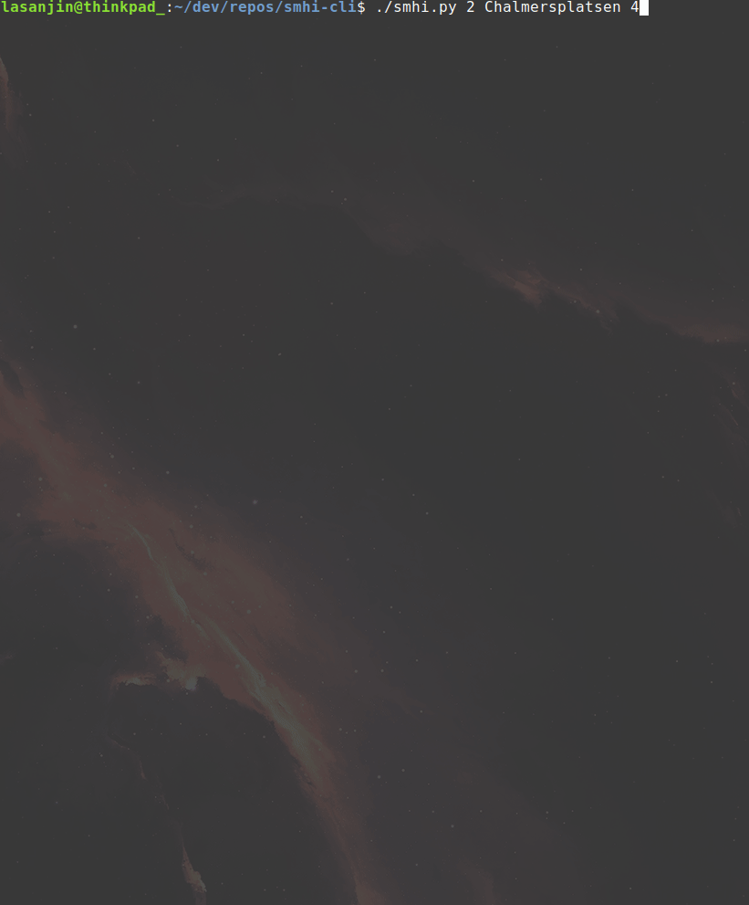

# SMHI Weather Forecast CLI
Outputs SMHI weather forecast (or warnings) in terminal.

## Description
  + Outputs weather forecast data from SMHI API in terminal
  + Shows
    + Ref time: Last time SMHI updated the forecast
    + Location: Coordinates and link to Google Maps
    + Data from API (Customizable)
      + Temperature
      + Wind
      + Min rain
      + Humidity
      + Visibility
      + Thunder
      + Weather desc.
        + Matching symbols was added besides the API
  + Accepts parameters for specific location ( see [*How to run*](##How-to-run "Instructions") )
    + If Google fails to find location current or default location (Gothenburg) is set


## Demo 



## Install
```
$ curl "https://raw.githubusercontent.com/lasanjin/smhi-cli/master/install.sh" | bash
```


## How to run
```
$ smhi $1 $@
```

- `$1` 
  -  *Optional*
  -  Forecast (Number of days) (Default is today's weather)
     -  `0-9`
  -  Warnings
     -  `-w`

- `$@` 
  -  *Optional*
  -  Requires `$1` (Does not work with `-w`)
  -  Location (Default location is current location or Gothenburg)
     -  Example
        -  *Göteborg*
        -  *Chalmersplatsen 4*
        -  *Kiruna centrum*
        -  *Stockholm Karl XII:s torg*
  -  `a-z` `A-Z` `0-9`
