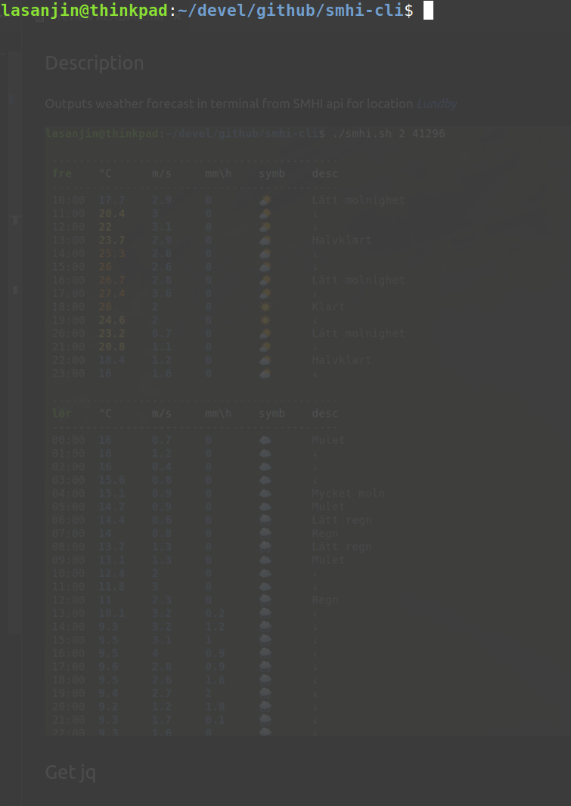

# SMHI Weather Forecast Bash CLI
Outputs weather forecast in terminal from SMHI API. Location is based on IP (Default location is [Lundby](https://www.google.com/maps/place/418+71+Lundby/@57.72043,11.9031789,15z/data=!3m1!4b1!4m5!3m4!1s0x464f8cac10ef6b77:0xe2938674a44ad114!8m2!3d57.7204193!4d11.9119337 "Link to location"))

## Demo


## How to run
```
$ ./smhi.sh $1 $2
```
- `$1` 
  -  *Required*
  -  Forecast (Number of days)
  -  Input `0-9`, default is today's weather

- `$2`
  -  *Optional*
  -  Requires `$1`
  -  Language
     -  `en` for English (Default is Swedish)