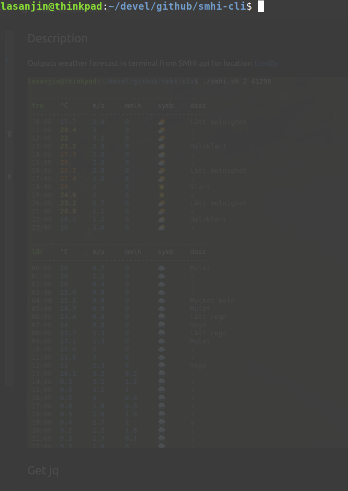

## Description
Outputs weather forecast in terminal from SMHI api for location [*Lundby*](https://www.google.com/maps/place/418+71+Lundby/@57.72043,11.9031789,15z/data=!3m1!4b1!4m5!3m4!1s0x464f8cac10ef6b77:0xe2938674a44ad114!8m2!3d57.7204193!4d11.9119337)



## Get jq
Alt 1
1. Install jq
```
$ sudo apt-get install jq
```

Alt 2
1. Download jq
```
$ wget https://github.com/stedolan/jq/releases/download/jq-1.6/jq-linux64
```
2. Make script executable
```
$ sudo chmod +x ./jq-linux64.sh 
```
1. Replace `jq` with `./jq-linux64` in [*smhi.sh*](../smhi.sh)


## How to run
1. Make script executable
```
$ sudo chmod +x smhi.sh 
```

2. Run script
```
$ ./smhi.sh $1 $2
```
- `$1` 
  -  *required*
  -  forecast (number of days)
  -  input `0-9`, default is today's weather

- `$2`
  -  *optional*
  -  requires `$1`
  -  language
  -  input `en` for English, default is Swedish